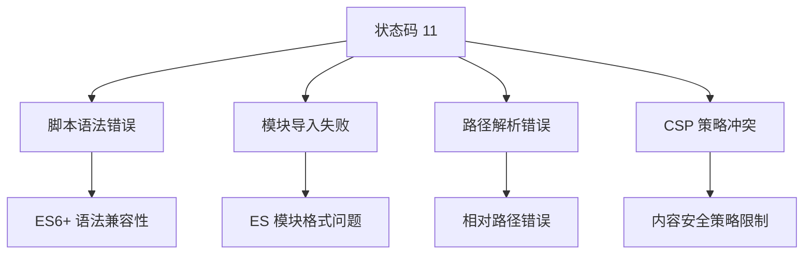
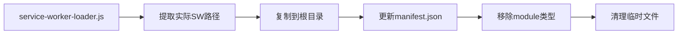
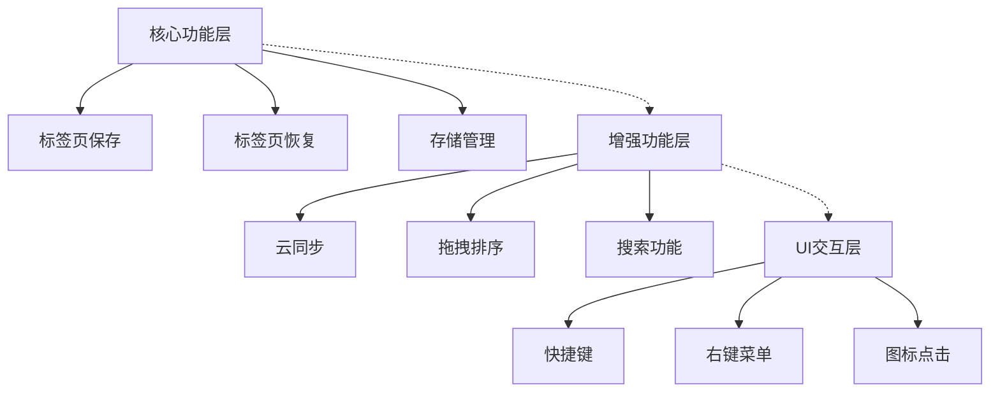

# Chrome 插件 Service Worker 激活失败问题分析与解决方案

## 概述

OneTab Plus Chrome 插件在开发环境运行正常，但发布到 Chrome 插件商店后出现 Service Worker 注册失败问题，错误码为 11，导致插件完全无法使用。

## 问题现状

### 症状描述
- **开发环境**：插件运行正常，所有功能可用
- **生产环境**：插件商店更新后，Service Worker 注册失败
- **错误信息**：Service worker registration failed. Status code: 11
- **影响范围**：插件完全无法使用，核心功能失效

### 技术背景
项目使用 Manifest V3 规范，采用 Service Worker 替代传统的 background script：
- Vite + @crxjs/vite-plugin 构建
- TypeScript 开发
- React 18 + Redux Toolkit 状态管理
- Supabase 云同步服务

## 根因分析

### 状态码 11 含义分析

Chrome 扩展的 Service Worker 注册失败状态码 11 通常表示：



### 构建差异分析

**开发环境 vs 生产环境差异：**

| 方面 | 开发环境 | 生产环境 |
|------|----------|----------|
| 模块打包 | 热重载，未优化 | 代码压缩，模块合并 |
| 路径处理 | 绝对路径 | 相对路径可能变化 |
| ES 模块 | 直接支持 | 可能需要转换 |
| 代码检查 | 宽松模式 | 严格模式 |

### 现有修复脚本分析

项目中已存在 `fix-service-worker.js` 脚本，其处理逻辑：



但该脚本可能存在以下问题：
1. 未处理 TypeScript 编译后的语法问题
2. 未检查生成文件的有效性
3. 缺少对 Chrome 版本兼容性的考虑

## 技术方案设计

### 方案 1：Service Worker 文件格式标准化

#### 实现策略
1. **确保 CommonJS 兼容性**
   - 移除 ES 模块导入语法
   - 使用 IIFE 包装代码
   - 避免 top-level await

2. **简化依赖结构**
   - 内联必要的工具函数
   - 减少外部模块依赖
   - 使用原生 Chrome APIs

#### 技术实现

```typescript
// 修改后的 service-worker.ts 结构
(function() {
  'use strict';
  
  // 内联所有依赖函数，避免模块导入
  const utils = {
    // 内联存储工具
    // 内联通知工具
    // 其他必要函数
  };
  
  // Service Worker 核心逻辑
  console.log('OneTab Plus Service Worker 启动');
  
  // 事件监听器注册
  chrome.runtime.onInstalled.addListener(/* ... */);
  chrome.action.onClicked.addListener(/* ... */);
  // ...
})();
```

### 方案 2：构建流程优化

#### Vite 配置调整

```typescript
// vite.config.ts 优化
export default defineConfig({
  build: {
    rollupOptions: {
      input: {
        'service-worker': 'src/service-worker.ts'
      },
      output: {
        format: 'iife', // 使用 IIFE 格式
        entryFileNames: '[name].js',
        // 禁用代码分割
        manualChunks: undefined
      }
    }
  }
});
```

#### 构建后处理脚本增强

```javascript
// 增强版 fix-service-worker.js
class ServiceWorkerFixer {
  validateSyntax(content) {
    // 检查潜在的语法问题
    const issues = [];
    
    if (content.includes('import ')) {
      issues.push('包含 ES 模块导入语句');
    }
    
    if (content.includes('export ')) {
      issues.push('包含 ES 模块导出语句');
    }
    
    return issues;
  }
  
  wrapInIIFE(content) {
    return `(function() {
      'use strict';
      ${content}
    })();`;
  }
  
  async fix() {
    // 完整的修复流程
  }
}
```

### 方案 3：渐进式降级策略

#### Manifest.json 优化

```json
{
  "background": {
    "service_worker": "service-worker.js"
    // 移除 "type": "module"
  },
  "content_security_policy": {
    "extension_pages": "script-src 'self'; object-src 'self';"
  }
}
```

#### 功能分层设计



## 实施方案

### 阶段 1：问题确认与环境准备
1. **复现问题**
   - 在 Chrome 商店环境测试
   - 收集详细错误日志
   - 分析构建产物

2. **构建产物分析**
   - 检查 service-worker.js 文件内容
   - 验证 manifest.json 配置
   - 分析文件依赖关系

### 阶段 2：Service Worker 重构
1. **代码简化**
   - 移除所有外部模块导入
   - 内联必要的工具函数
   - 使用原生 Chrome APIs

2. **语法兼容性**
   - 转换为 ES5 兼容语法
   - 使用 IIFE 包装
   - 避免现代 JS 特性

### 阶段 3：构建流程优化
1. **Vite 配置调整**
   - 优化 Service Worker 构建
   - 禁用不必要的优化
   - 确保文件路径正确

2. **后处理脚本**
   - 增强现有修复脚本
   - 添加语法验证
   - 实现自动化测试

### 阶段 4：测试验证
1. **本地测试**
   - 构建生产版本
   - 加载到 Chrome 测试
   - 验证核心功能

2. **发布测试**
   - 内测版本发布
   - 用户反馈收集
   - 问题修复验证

## 风险评估与缓解

### 技术风险

| 风险 | 影响 | 概率 | 缓解措施 |
|------|------|------|----------|
| 语法兼容性问题 | 高 | 中 | 多版本 Chrome 测试 |
| 功能降级 | 中 | 低 | 分层设计，核心功能优先 |
| 构建复杂度增加 | 低 | 中 | 自动化脚本，文档完善 |

### 业务风险

| 风险 | 影响 | 概率 | 缓解措施 |
|------|------|------|----------|
| 用户流失 | 高 | 高 | 快速修复，用户沟通 |
| 商店评分下降 | 中 | 中 | 主动更新说明 |
| 竞品优势扩大 | 中 | 低 | 功能优化，体验提升 |

## 监控与维护

### 错误监控
```javascript
// Service Worker 错误监控
self.addEventListener('error', (event) => {
  console.error('Service Worker Error:', event.error);
  // 发送错误报告到服务器
});

self.addEventListener('unhandledrejection', (event) => {
  console.error('Unhandled Promise Rejection:', event.reason);
  // 记录详细错误信息
});
```

### 性能监控
```javascript
// 启动性能监控
const startTime = performance.now();
self.addEventListener('activate', () => {
  const activationTime = performance.now() - startTime;
  console.log(`Service Worker 激活耗时: ${activationTime}ms`);
});
```

### 兼容性检测
```javascript
// Chrome 版本兼容性检测
const chromeVersion = navigator.userAgent.match(/Chrome\/(\d+)/)?.[1];
if (chromeVersion && parseInt(chromeVersion) < 88) {
  console.warn('Chrome 版本较低，可能存在兼容性问题');
}
```

## 后续优化建议

### 短期优化（1-2 周）
1. 实施核心修复方案
2. 加强错误监控
3. 优化构建流程

### 中期优化（1-2 月）
1. 重构代码架构
2. 实现渐进式增强
3. 完善测试覆盖

### 长期优化（3-6 月）
1. 探索新的构建工具
2. 升级技术栈
3. 性能深度优化