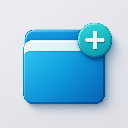

# TapStack

当前版本：`1.22.3`

最近变更：`v1.22.0` 无墓碑重写——

1. **删除即删除**：彻底移除墓碑体系（本地回收站、标签级墓碑、URL 去重坟场、空壳清理补丁）。删除前确认保留（删除全部强制确认），删除后物理清除，不进回收站、不可恢复。
2. **跨设备删除广播**：组删除经 `pendingDeleteIds` 队列 → 云端行标记 `is_deleted`（行保留 = 对端服从删除的载体）→ 30 天后物理清理；标签增删经组级 LWW **整组覆盖**广播（无 tab 级合并）。已知代价：两台设备同时编辑同一会话，后保存方整组赢。
3. **升级迁移** `tombstones_removed_v1`：首启清除本地全部墓碑组（旧回收站内容，不可恢复）与历史标签级墓碑——修复"计数虚高、恢复不完整"（回收站显示 1000+ 恢复 100+）的根因。

前情：`v1.21.x` 墓碑 7 天生命周期（删除进回收站）+ P0 结构手术（`docs/v2-plan.md` P0 完成态）。V2 同步架构重构进行中——Yjs 影子双写 100% 灰度（读路径仍走快照，P1 对账观察期），云端日志管道（P2）未启动。

---

TapStack 是一个面向重度浏览器用户的工作会话保险箱。它的核心目标不是“多一个标签管理器”，而是帮助你把当前窗口保存成可找回、可恢复的工作现场。



## 产品定位

- Save the session
- Find it later
- Restore it when you need it

适合这几类用户：

- 开发者：文档、PR、Issue、控制台、监控、后台同时开很多页
- 研究型用户：论文、论坛、竞品、视频、资料长时间并行打开
- 内容作者：选题、草稿、引用、素材、后台需要反复切换
- 销售 / 招聘 / 投资：CRM、表格、邮件、公司页、Notion 长时间保持上下文

## 当前能力

- 保存当前窗口中的标签页为一个工作会话（整窗 / 单个标签 / 右键菜单 / 快捷键）
- 以后按会话名称、标签标题、URL 找回内容
- 支持按会话备注搜索，并收藏关键会话
- 在新窗口中恢复整个会话，尽量不打乱当前窗口
- 新会话默认按保存时间生成时间戳名称，可按需重命名
- 会话重命名、备注、收藏、锁定防误删、拖拽排序、清理重复标签
- 误删保护：删除前二次确认（删除全部强制确认），删除即物理清除
- 支持导入 / 导出 OneTab 文本格式，JSON 备份导出
- 4 套主题风格（legacy / aurora / creamy / prism）+ 暗色模式，单 / 双栏布局
- 登录后自动同步：数据变更自动上传，登录时自动从云端合并下载
- 网页版 Dashboard（Vercel 部署）：浏览器里查看和管理云端会话

## 当前同步模式

当前版本采用**增量自动同步**，并保留手动入口。

- **自动上传**：保存 / 重命名 / 删除 / 移动 / 锁定等数据变更后，自动防抖推送到云端。
- **自动下载**：已登录用户打开应用时，自动从云端合并拉取到本地（跨设备找回）。
- **合并安全**：下载采用「快照 → 下载 → 合并 → 校验 → 写入」，合并结果异常时自动回滚，避免同步覆盖丢失本地数据。
- **手动入口**：工具栏同步按钮仍可手动上传（覆盖 / 合并）与下载（覆盖 / 合并），由单一 SyncEngine 统一调度。
- **删除广播**：删除是物理操作（本地不留任何痕迹）。跨设备同步靠云端行上的 `is_deleted` 标记（Supabase migration `supabase/migrations/20260825130248_add_is_deleted_tombstone.sql`，已在生产库执行）——对端合并时该标记优先于旧内容，被删内容不会“复活”。标记行 30 天后自动清理。
- **整组覆盖**：同一会话在两台设备上被同时编辑时，以**最后保存的一方**为准（会话内标签的增删随整组一起同步，不逐标签合并）。错峰使用不受影响。
- **单引擎**：所有同步（自动 + 手动 + 设置同步）统一走 `syncEngine.ts`，旧 `syncService` / `smartSyncService` / `tabSyncWorkflow` 已移除。
- 没有登录时不触发云端同步。
- **保存路径**：popup 按钮 / 快捷键 / 右键菜单都走 SW `TabManager.saveAllTabs()` → `storage.setGroups()` 后立刻调 `syncEngine.scheduleUpload(3000)`（防抖）推送。`autoSyncMiddleware` 仅兜底转发设置类 action（`settings/*`）的上传调度；重命名 / 删除 / 锁定等写操作的上传调度在 SW 侧 `mutationHandlers` 完成；MV3 SW 是独立执行上下文，`syncEngine.upload()` 进入点懒恢复登录态（重复调用是 no-op，与 `backgroundSync` 一致）。

## 不承诺的能力

当前版本不把以下能力作为已交付承诺：

- 多端实时并发协同编辑（优先级冲突仍按合并策略解决，非实时）
- **严格意义上的端到端加密**（v1.17.0 hotfix：之前的描述误导。客户端对 `tabs_data` 做 AES-GCM 加密后上传，
  密钥派生自 `userId`（PBKDF2-SHA256, 100k iter），但 `userId` 是公开标识（与 `user_id` 列同
  表相邻），任何获得数据库读权限的攻击者都可以重新派生密钥解出明文浏览记录——
  当前实现提供的是「传输加密 (TLS) + 服务端静态加密」，不是 E2E。若需要真正的 E2E，
  需改成用户密码派生的 Argon2id 密钥 + 服务端盲存，是个独立的大改动）。

## 安装

### 从 Chrome 商店安装

- 访问 [Chrome Web Store](https://chrome.google.com/webstore) 并搜索 `TapStack`

### 开发模式安装

```bash
git clone https://github.com/hibernate-pano/chrome-plugin-one-tab.git
cd chrome-plugin-one-tab
pnpm install
pnpm build
```

然后在 `chrome://extensions/` 中开启开发者模式并加载 `dist` 目录。

## 使用方式

### 保存会话

- 点击扩展图标，或在主界面点击“保存会话”
- 当前窗口中的标签页会被保存成一个新会话
- 可配置是否一并保存固定标签页

### 找回会话

- 在搜索框中输入会话名、备注、标签标题或 URL
- 搜索结果会优先展示匹配到的会话，再展开具体标签命中
- 可按域名、固定标签、保存时间继续筛选

### 恢复会话

- 点击会话卡片上的“恢复整个会话”
- 会在新窗口中恢复该会话
- 未锁定会话恢复后会从列表中移除；锁定会话会保留

### 会话命名

- 新保存的会话默认命名为 `标签组 + 保存时间`
- 你可以在保存后手动重命名，让会话更容易再次找回

### 导入 / 导出

- 支持 JSON 备份导出
- 支持 OneTab 文本导入和导出

## 开发

```bash
pnpm type-check
pnpm lint
pnpm build
pnpm validate
```

`pnpm validate` 会先校验扩展元数据，再执行类型检查、Lint 和构建。

如果你要验证真实 Supabase 数据链路，可以额外执行：

```bash
TEST_EMAIL="your-test-user@example.com" TEST_PASSWORD="your-password" pnpm test:supabase-smoke
```

这个 smoke test 会验证登录、设置同步、会话写入和 RLS 生效情况，并在结束后自动清理临时测试数据。

## 隐私与数据

- 本地数据默认保存在浏览器扩展存储中
- 登录后，云端数据仅用于跨设备找回和主动触发的同步
- 同步采用增量防抖：保存 / 重命名 / 删除 / 锁定后自动上传云端；后台 alarm 每 60s 自动拉取云端变更到本地（未登录不触发）
- 你可以随时用手动入口（同步按钮）切换“合并 / 覆盖”模式或强制重新同步

## 仓库

- 项目主页：[hibernate-pano/chrome-plugin-one-tab](https://github.com/hibernate-pano/chrome-plugin-one-tab)
- 问题反馈：[Issues](https://github.com/hibernate-pano/chrome-plugin-one-tab/issues)

## License

MIT
