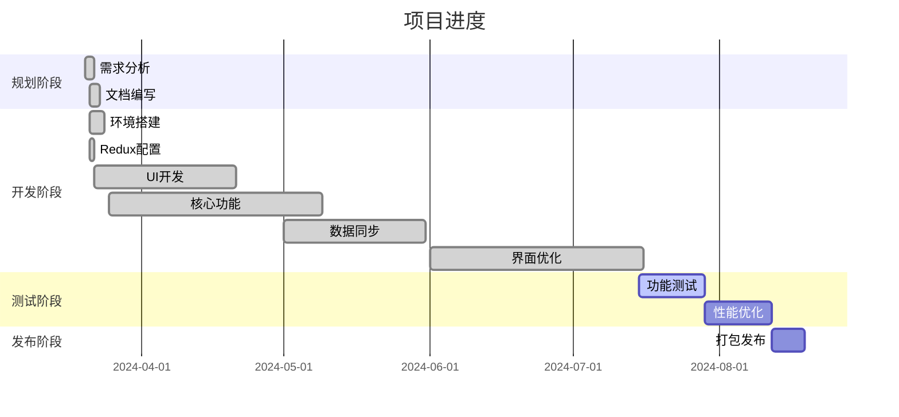

# 活动上下文

## 当前开发阶段

项目已发展到 v1.4.3 版本，完成了以下主要功能和改进：

1. 界面优化
   - [x] 添加双栏布局功能
   - [x] 实现布局切换按钮
   - [x] 优化标签组卡片设计
   - [x] 优化搜索结果显示
   - [x] 添加搜索结果"恢复全部"功能

2. 标签组管理
   - [x] 添加标签组重命名按钮
   - [x] 实现锁定标签组功能
   - [x] 优化标签组显示方式
   - [x] 实现标签组拖拽排序

3. 数据同步
   - [x] 实现基于 Supabase 的云同步
   - [x] 添加用户注册和登录功能
   - [x] 实现数据压缩传输
   - [x] 添加同步策略设置

## 当前决策

1. 技术选型
   - 使用 TypeScript + React 技术栈
   - 选择 TailwindCSS 作为样式解决方案
   - 使用 Redux 进行状态管理
   - 采用 Webpack 作为构建工具
   - 使用 Supabase 作为后端服务

2. 架构决策
   - 采用组件化开发方式
   - 实现模块化的状态管理
   - 使用 Chrome 扩展 API 进行浏览器交互
   - 实现本地数据持久化和云端同步
   - 优先考虑用户体验和界面简洁性

## 下一步计划

1. 短期目标（1-2周）
   - 添加快捷键支持
   - 实现数据导入/导出功能
   - 优化大量标签页的性能
   - 完善错误处理机制

2. 中期目标（1个月）
   - 实现虚拟列表，提高大量标签时的性能
   - 优化移动端适配
   - 添加更多自定义选项
   - 进行全面测试

3. 长期目标（2-3个月）
   - 提交 Chrome 商店审核
   - 收集用户反馈并迭代
   - 考虑添加高级功能
   - 扩展到其他浏览器平台

## 待解决问题

1. 技术问题
   - 大量标签页的性能优化
   - 存储限制处理
   - 浏览器兼容性测试
   - 同步冲突解决策略优化

2. 功能问题
   - 快捷键配置方案
   - 数据导入/导出格式设计
   - 高级搜索功能增强
   - 标签组嵌套结构可行性

## 风险评估

1. 技术风险
   - Chrome API 限制
   - 存储容量限制
   - 性能瓶颈
   - 浏览器兼容性

2. 项目风险
   - 用户接受度
   - 竞争产品差异化
   - 维护成本控制
   - 云服务依赖性

## 当前进度

项目完成度：75%

