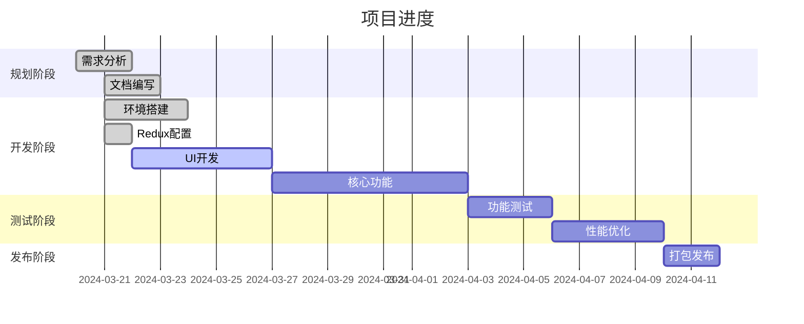

# 活动上下文

## 当前开发阶段

项目已完成初始化、基础配置和Redux存储设置，主要工作内容包括：

1. 文档编写
   - [x] 项目简介
   - [x] 产品上下文
   - [x] 系统架构
   - [x] 技术上下文
   - [x] 进度跟踪

2. 环境搭建
   - [x] 项目初始化
   - [x] 依赖安装
   - [x] 开发环境配置
   - [x] 构建流程设置

3. 基础架构
   - [x] 目录结构创建
   - [x] Chrome扩展配置
   - [x] 状态管理设置
   - [ ] 核心组件设计
   - [ ] API集成

4. Redux实现
   - [x] 数据类型定义
   - [x] Storage工具类
   - [x] Tab Slice实现
   - [x] Settings Slice实现
   - [x] Store配置

## 当前决策

1. 技术选型
   - 使用pnpm替代npm作为包管理器
   - 确定使用TypeScript + React技术栈
   - 选择TailwindCSS作为样式解决方案
   - 使用Redux进行状态管理
   - 采用Webpack作为构建工具

2. 架构决策
   - 采用组件化开发方式
   - 实现模块化的状态管理
   - 使用Chrome扩展API进行浏览器交互
   - 实现本地数据持久化

## 下一步计划

1. 短期目标（1-2天）
   - 开发基础UI组件
   - 实现弹出窗口界面
   - 创建标签列表组件
   - 实现标签组组件

2. 中期目标（3-7天）
   - 完善UI界面
   - 实现所有核心功能
   - 添加主题支持
   - 优化用户体验

3. 长期目标（1-2周）
   - 完善所有功能
   - 优化性能
   - 进行测试
   - 准备发布

## 待解决问题

1. 技术问题
   - Chrome扩展manifest v3适配
   - 大量标签页的性能优化
   - 数据存储限制处理
   - 浏览器兼容性测试

2. 功能问题
   - 标签组的最佳组织方式
   - 搜索功能的实现方案
   - 数据导入/导出格式
   - 快捷键配置方案

## 风险评估

1. 技术风险
   - Chrome API限制
   - 存储容量限制
   - 性能瓶颈
   - 浏览器兼容性

2. 项目风险
   - 开发周期控制
   - 功能完整性
   - 用户体验保证
   - 维护成本控制

## 当前进度

项目完成度：25%

